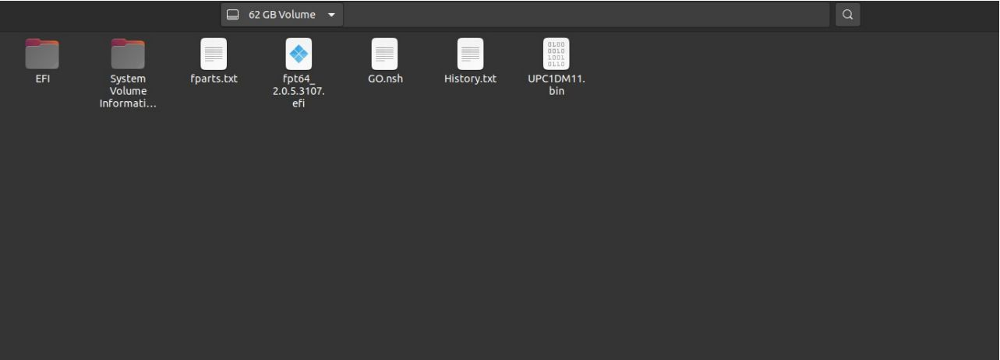
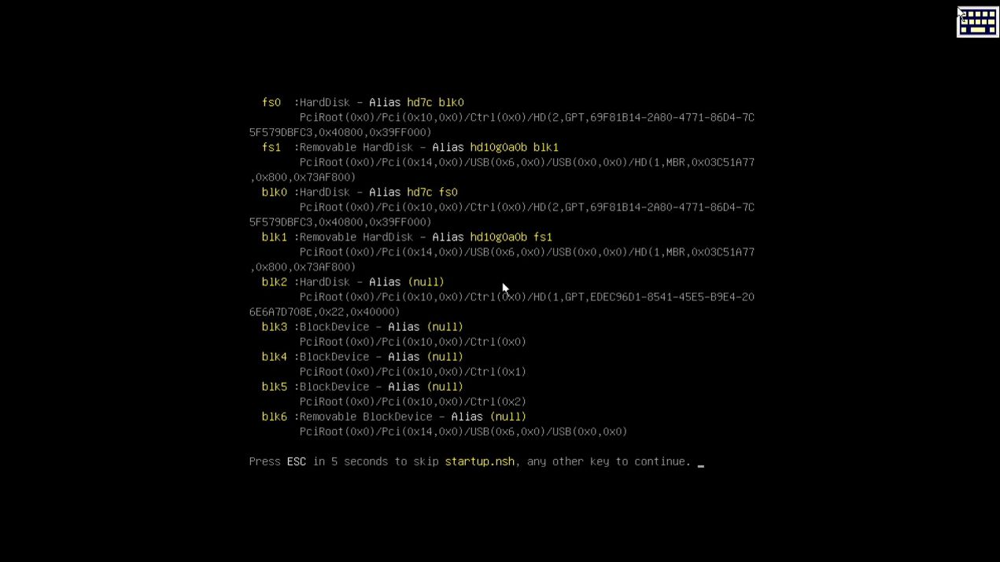
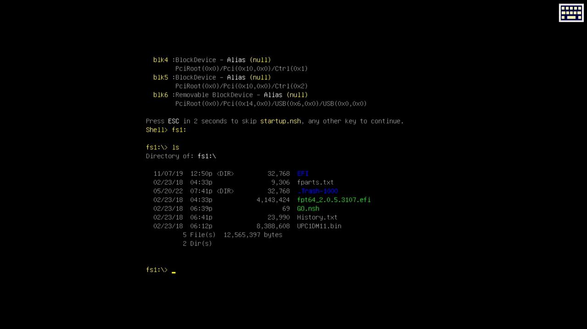
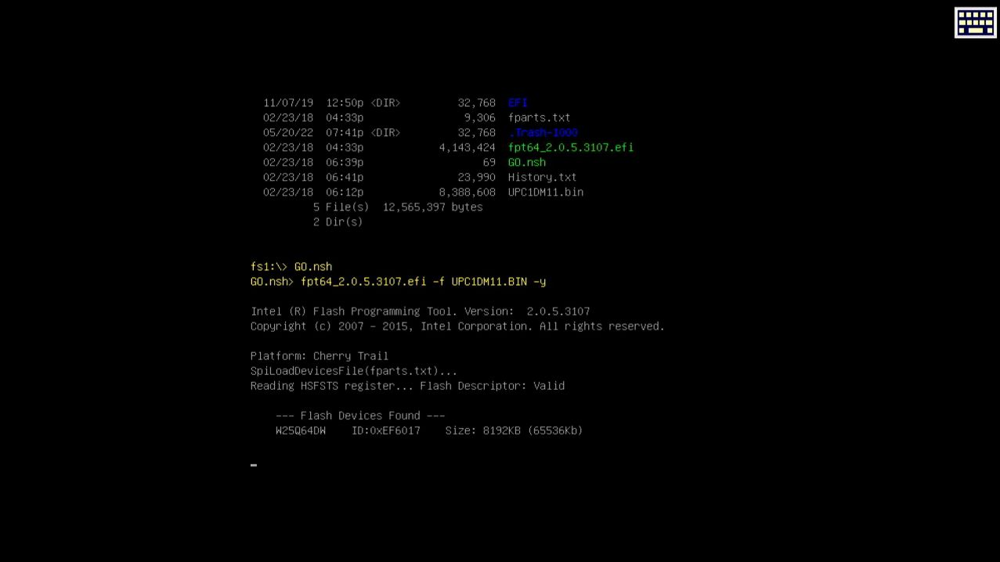

# BIOS

## What's it?
 [BIOS](https://en.wikipedia.org/wiki/BIOS, "BIOS Description") in a simple way is what do tasks when the computer starts, BIOS can recognize the installed hardware, verify connected devices and inicialize an Operating System.

## UpBoard Network Stack's problem

Our UpBoard model has a not updated BIOS version, and updating is necessary for using the Network Stack function, which provides the cluster communication.

### Network Stack

 [Network Stack](https://en.wikipedia.org/wiki/Protocol_stack) allows the PXE boot [PXE](https://en.wikipedia.org/wiki/Preboot_Execution_Environment) through our connected network, and from PXE server, we can enter with a client and start up a bootable OS image, for that, we need to enable the Network Stack function.

# Updating UpBoard BIOS

For starting a process is necessary find a UEFI BIOS version compartible with our UpBoard model. After trying some UEFI BIOS versions and researching on internet, the only version that runned  correctly was the UPC1DM11 [UPC1DM11](https://downloads.up-community.org/download/up-board-uefi-bios-upc1dm11/), which is a version for the UpBoard model described in the project and has Network Stack functions.

## How to:
You can see below step by step how to update the BIOS and some installations advices.

> :warning:
> The mentioned BIOS version (UPC1DM11) is compatible with two UpBoard versions, UpBoard with 2GB RAM and 4GB RAM.

> :warning:
> You need to remove all USB devices, but the USB device that has the BIOS files. 


### What we are going to do


1. Unziping the download files into a bootable USB drive. 
1. Turning on the board with the USB drive plugged.
1. Selecting a boot through the shell loader.
1. Entering into a directory in pendrive which has the BIOS file and update the batch.
1. Rebooting the system.

<details open><summary>Step by step</summary><blockquote>

1. Installing BIOS into USB stick
    - After the download, make sure to unzip in a way that all files can be seen, as you can see below:

<br>
<div></div>
<div>Own authorship, 2022.</div>   
<br>

2. Updating System BIOS
    - Starts UpBoard after connecting all necessary devices.
    - Wait for displaying it:

<br>
<div></div>
<div>Own authorship, 2022.</div>   
<br>
Search for the USB stick device.
- In this case the device's label is fs1
    - Open the device's content file and observates, and compare with the image below.

<br>
<div></div>
<div>Own authorship, 2022.</div>   
<br>

- Run the file GO.nsh by writing.


```bat
fs1:\> GO.nsh
```
    
and click the button  <kbd>Enter</kbd> .

<br>
<div></div>
<div>Own authorship, 2022.</div>   
<br>

- BIOS will start updating, at the end, the UpBoard will restart by itself. After rebooting you can extract the USB stick.

</blockquote></details>