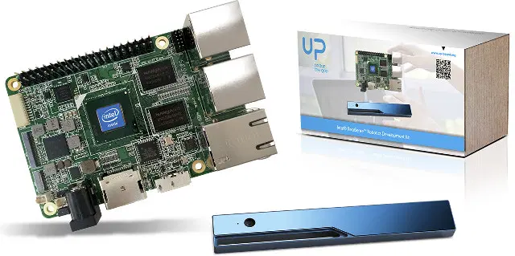

# __Hardware Infrastructure__

## __Hardware used by the project__

The hardware used by our cluster is:
- 24 x UpBoard
- 24 x USB's
- 1 Switch
- 24 pen drives
- Power Supply Cables
- Adapters
- 24 LED's

## __Describing__

The [UpBoard](https://up-board.org/up/specifications, "UpBoard Specifications") is a [Single Board Computer](https://en.wikipedia.org/wiki/Single-board_computer, "Single Board Computer Description") with a layout that looks like a RaspberryPi layout [Raspberry Pi](https://en.wikipedia.org/wiki/Raspberry_Pi, "RaspBerryPi Description"), the actual UpBoard model that we are using is from the __IntelRealSense Robotic Developmente Kit Features Atom X5 UP Board, Realsense R200 Depth Camera__.

### __Our UpBoard Specifications:__
- SoC – Intel Atom x5-Z8350 “Cherry Trail” quad core processor @ 1.44 GHz -(Burst frequency: 1.92 GHz) with Intel Gen8 HD graphics
- System Memory –  4GB DDR3L-1600
- Storage – 32 GB eMMC flash
- Video Output / Display – HDMI 1.4b, MIPI DSI/eDP interface
- Audio I/O – HDMI, I2S
- Connectivity – Gigabit Ethernet
- USB – 4x USB 2.0 host ports, 2x USB 2.0 pin header, 1x micro USB 3.0 port
- Camera – MIPI CSI up to 4MP
- Expansion – 40-pin Raspberry Pi compatible header
- Misc – Power button, RTC
- Power Supply – 5V/3A via 5.5/2.1mm jack
- Dimensions – 85.60 x 56.50 mm
 
 

Intel RealSense Robotic Development Kit Features Atom x5 UP Board, Realsense R200 Depth Camera. 2016.<a href="https://www.cnx-software.com/2016/04/14/intel-realsense-robotic-development-kit-features-atom-x5-up-board-realsense-r200-depth-camera/">   cnx-software</a>.

 
 

## Why we chose UpBoards?
We chose this UpBoard model thinking about reutilizing some parts from our store (UpBoards) that wasn't more being used in the instituition. Some time ago, UpBoards were used in Robotics, but went replaced by RaspBerry Pi 4.
The chosen Upboard has a x86 architecture, which can provide many resources. The UpBoard is compatible with many softwares that requires necessary a x86 architecture.

## Applications

We can use UpBoards for many different purposes, in the list below you can see three of them:

- Exoplanet Hunter
- Distributed Computing (MPI)
- Black Hole Simulator

