# Physical Infrastructure
 

{width=300}

 
The cluster structure was made in a rack format containing 24 drawers. Since the project was based on the DevKit Upboards, the design of the cluster started through the concept of a drawer that could hold the board model, giving access for connecting cables (ethernet and USB cable) and airflow through specific cutouts on its acrylic body.

<figcaption>Screw connectors</figcaption>

 

<figcaption>Cutouts for cable connections and air flow</figcaption>

 

The drawers are organized in two stacks of 12 units in a symmetrical arrangement where the stacks are opposite each other. Between the drawers it is possible to identify a space destined to contain the cluster network switch and behind this set an area was provided for storing the system cables that is enclosed by a set of two doors.

<figcaption>Drawers positions and doors for the cables enclosure</figcaption>

 

Above this structure, a specific niche was designed to store the router (*router name*) that is also enclosed by another door at the rear.

<figcaption>Niche for the router</figcaption>

## Materials

The whole rack is made of 3mm thickness acrylic sheet. The choice of material is due to the large amount of leftovers and scraps available for the project. It is worth noting that this material comes from old protections for service areas used during the 2020 COVID-19 pandemic.

{width=700}
<figcaption>Acrylic scraps from protections for service areas</figcaption>

 

After vaccination of a large part of the population and a drop in mortality due to the virus, these acrylic protections were removed and a large amount of this material was found accessible and available for reuse.

## Rack Building Process

The rack building process can be essentially divided into 4 parts:

1. 3D digital modeling the cluster rack in CAD (Autodesk Fusion 360).
2. Cutting the designed parts using a laser cutting process.
3. Bending the drawers walls by molds and heat.
4. Assembling the cutted and bent parts.

Below is the process used in each step.

### 3D Digital Model

The CAD (computer-aided design) software used to design the rack was the Autodesk Fusion 360. Considering that the material avaiable for the project was the 3mm thickness acrylic sheets mentioned before, it was a concern to create a design that contemplated its physical characteristics and properties. 

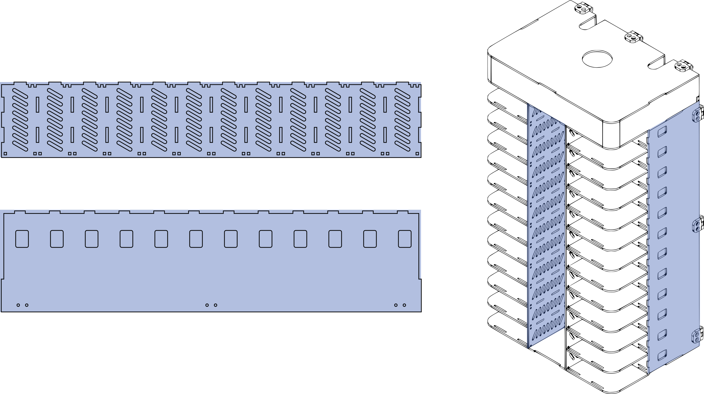
<figcaption>2D projections from the rack parts</figcaption>

 

The designing concept were based on 2D profiles of each component with the exception of the frontal piece of the drawer. The thermoplastic properties of acrylic were harnessed to create the L-shaped part. This same part, when is assembled with the rest of the rack, gives to the structure a look similar to a building construction.

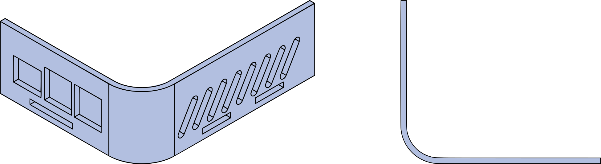
<figcaption>Drawer L-shaped part</figcaption>

 

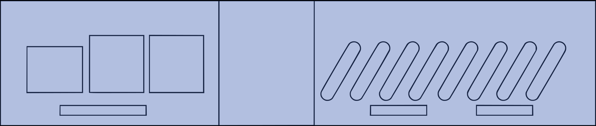
<figcaption>2D projection from the L-shaped part</figcaption>

### Laser Cutting Parts

The parts manufacturing happened through a laser cutting process. 

A 2D projection from parts profiles were created and organized as a sketch in Fusion 360. 

<figcaption>2D projection from the L-shaped part</figcaption>

 

The skecth is exported in a DXF file to be imported in a second software called RDWorks. RDWorks is a CAM (computer-aided manufacturing) software. In this software is possible to work on the dxf file organizing the profiles according to the material sheet used in the laser cutting machine, defining what will be cutted and what will be engraved by changing the vectors color and configuring the paremeters for cutting, in this manufacturing process the paremeters are essentially speed and laser power. It is important to mention that we are using leftovers and scraps of acrylic sheets, what means that the size of those materials were not the same between each other and none of them meet the necessary dimension for cutting all the pieces at once.

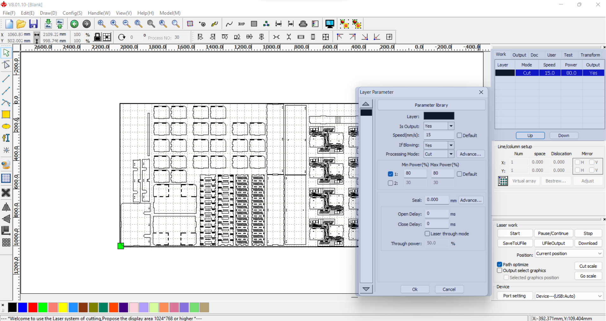
<figcaption>Paremeters (speed and power) settings in the RDWorks software</figcaption>

 

After setting up the paremeter a code file in RD format is saved and sent to the laser cutting machine. 

*images/gif showing the laser cutting machine manufacturing some pieces (maybe a drawer)*

### Manufacturing The Bent Parts

The acrylic is a thermoplastic. Thermoplastic materials has as property the ability to deform when exposed to high temperatures.Using this characteristic of the material, it was possible to idealize an L-shaped piece for front and side part of the drawers.

 

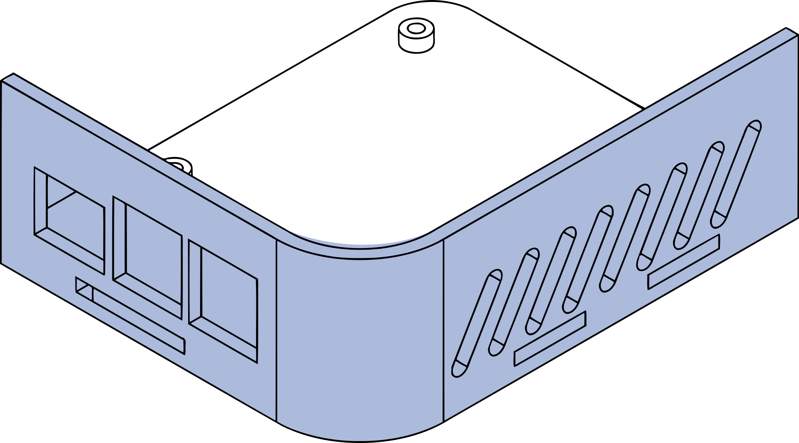{width=500}
<figcaption>Paremeters (speed and power) settings in the RDWorks software</figcaption>

 

To create the L-shaped piece, it was necessary to build a mold that would allow the acrylic to be deformed accordingly. The mold was also designed in Fusion 360. The digital model of the L-shaped piece were used as counter mold to create the following two bodies.

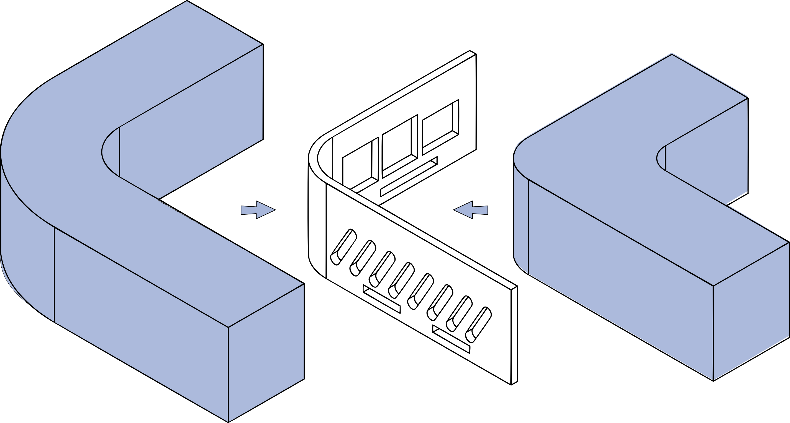
<figcaption>Mold bodies modeled from the L-shaped part</figcaption>

 

The bodies are exported as STL files and then imported in a software called Autodesk SlicerforFusion360. In this software those bodies are sliced in layers of 3mm thickness that is the same thickness of the mdf wood scraps used for the mold manufacturing. A DXF file with the 2D projections of the layers are exported from the SlicerforFusion360 ready to be prepared in RDWorks and then be cutted in the laser cutting machine.

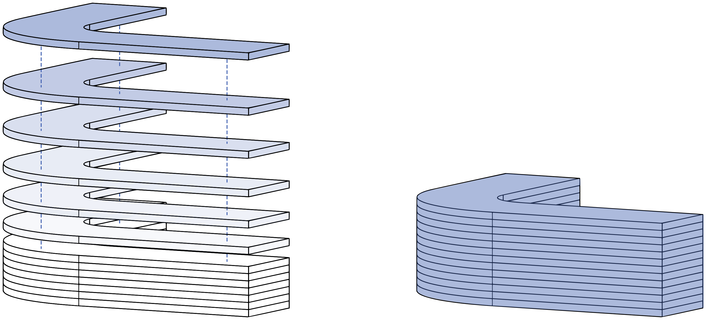
<figcaption>Mold after being sliced in SlicerforFusion360</figcaption>

 

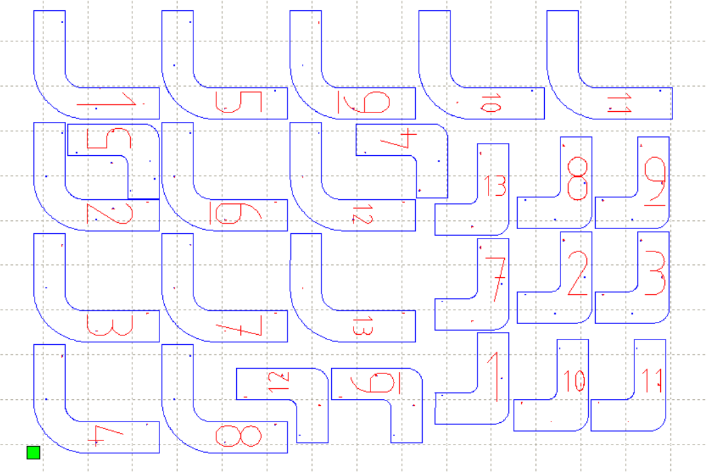
<figcaption>Mold 2D projections in RDWorks</figcaption>

 

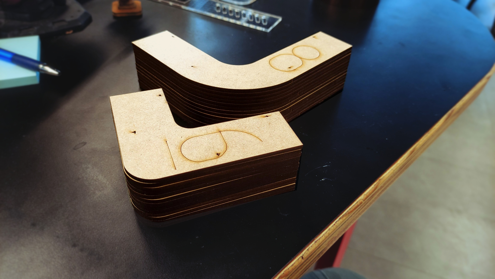
<figcaption>Layers of laser-cut mdf stacked to shape the mold</figcaption>

 

After this process, those layers are glued and stashed over each other reproducing the two parts molds designed originally in the Fusion 360. 

For the from part of the drawer getting the L-shaped idealized by the design, it is important to notice the the corresponding piece cutted previously in the laser cutting machine has some marks (three parallel lines located in the middle of the piece) on its surface. Those marks were engraved and they are intended to define the area in which the material will be bent, delimiting where the curvature begins and ends.

<figcaption>Bending area delimited by the line marks</figcaption>

 

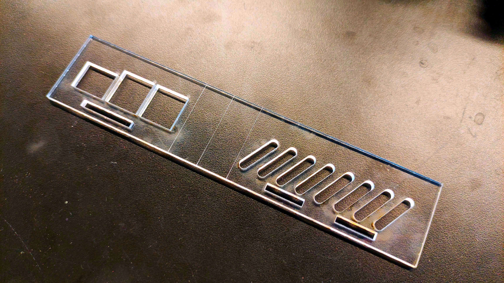
<figcaption>L-shaped part after laser cutting and with the engraved marks for bending process</figcaption>

 

Using a couple of mdf wood scraps and a heat blower, this area between the marks were isolated and heated until the acrylic piece soften. 

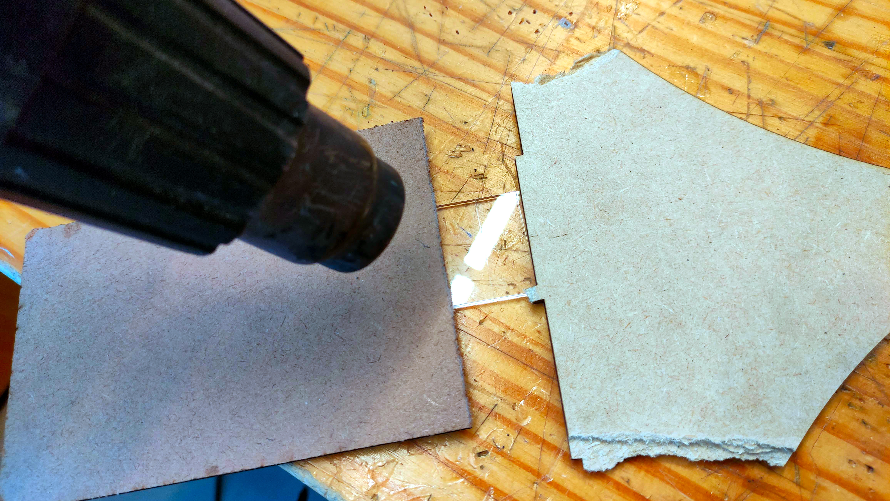
<figcaption>Heating up the bending area</figcaption>

 

The two parts molds were use to embrace the soften piece giving it the L-shaped aspect until it cools down, resulting in the desired part.

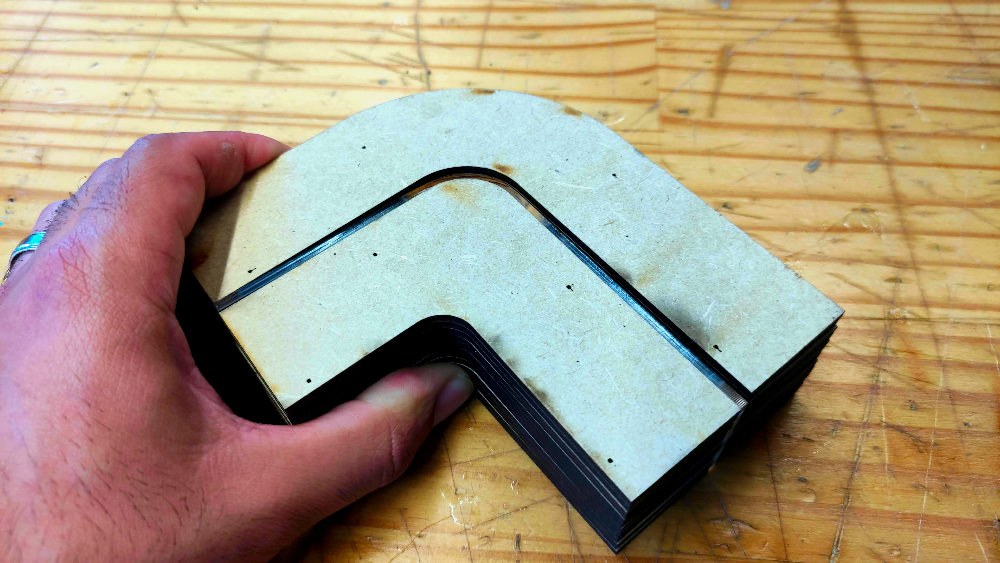
<figcaption>Molding the part after heated</figcaption>

 

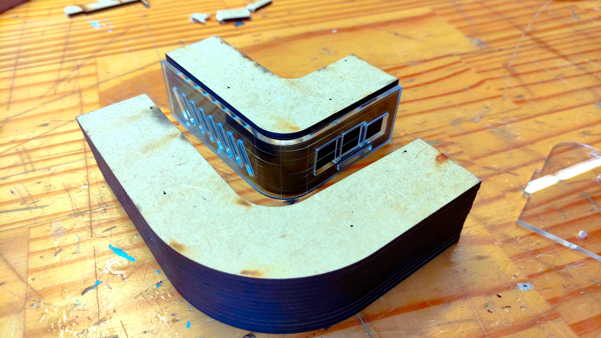
<figcaption>L-shaped part after the molding process</figcaption>

 

After this process, the L-shaped part was assembles with the rest of the drawer pieces.

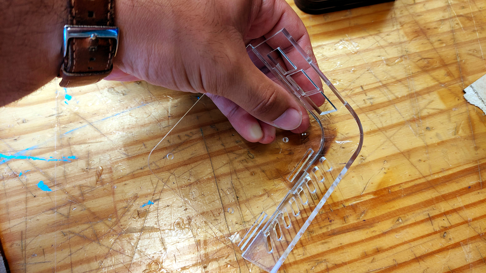
<figcaption>Assembling the drawer parts</figcaption>

 

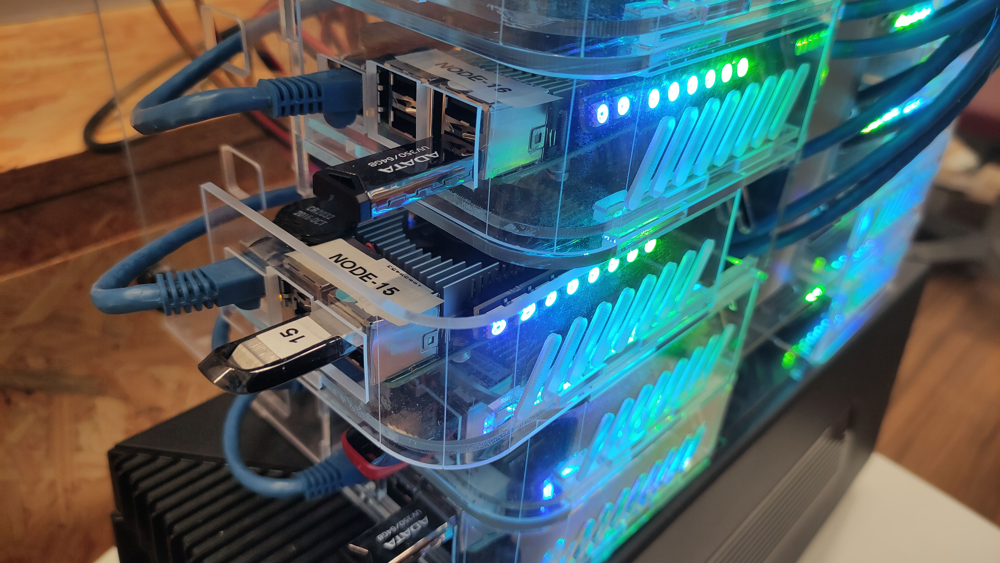
<figcaption>Drawer fitted into the rack</figcaption>

 

### Rack Assembly

With the manufacturing processes done, the rack assembly was performed. It is worth noting that the pieces have specific fittings through cutouts and pins corresponding to each other, but these fittings are not pressure-adjusted what requires the use of adhesion solutions, such as glue. In the case of the acrylic pieces, a solution called S-320 was used. This solution has a glue effect when it reacts with the polymer, fusing the pieces that are in contact.

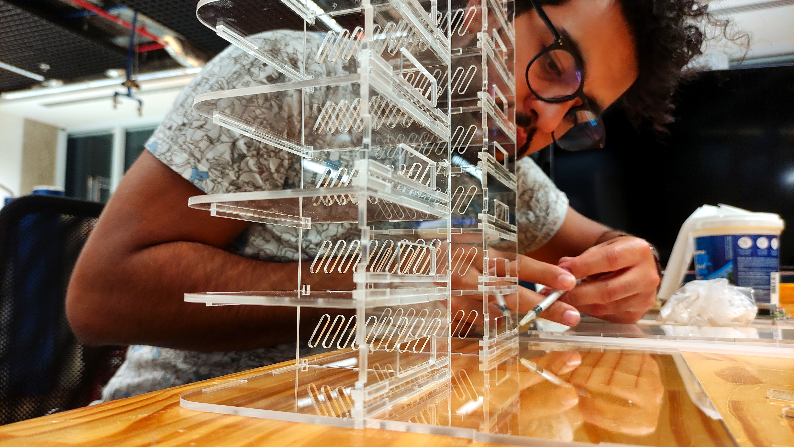
<figcaption>Assembling the rack parts with the S-320 solution</figcaption>

 

<figcaption>Final result of rack assembly</figcaption>

 

For a reference purpose, there is the exploded perspective of the rack. It is possible to check in the image below where each component of the rack are assembled.

{width=800}
<figcaption>Drawer exploded perspective</figcaption>

 

{width=800}
<figcaption>Router niche exploded perspective</figcaption>

 

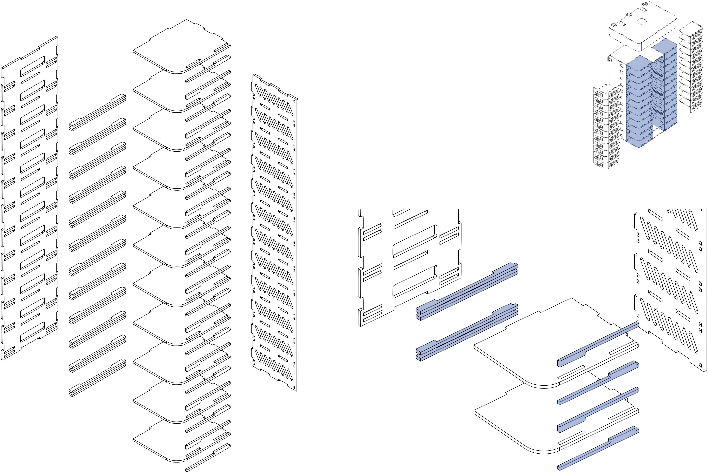{width=800}
<figcaption>Drawer shelves exploded perspective</figcaption>

 

{width=800}
<figcaption>Rack exploded perspective</figcaption>

 

*images with rack exploded perspective*

## Parts Files

In this section is possible to download and work on the same files presented in the previously.

Click [here](https://insper-my.sharepoint.com/:f:/g/personal/leonardonr1_insper_edu_br/Eh0B72-dcSVIvPGwLCOnR-oB-YIDtvz6Izd2h586OY8hQQ?e=SPmWfI)
to get access to the files.
