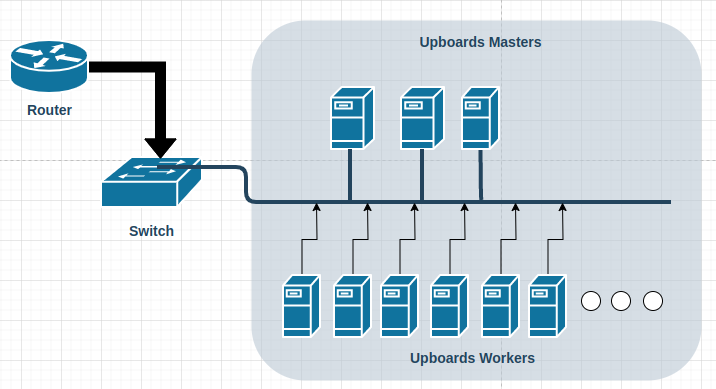

# Networking configuration for Cluster

Last edited time: May 24, 2023 8:21 PM
Owner: Tiago Demay



# Background…

The UpCluster project is a collaborative effort carried out by a team of researchers who are developing a cluster of Single Board Computers using Kubernetes as the container orchestrator.

A cluster is a set of interconnected computers that work together to perform tasks in a coordinated manner, increasing computational capacity and resource availability. In the case of UpCluster-Insper, the computers used are UPboard Intel Single Board Computers, which are printed circuit boards that contain all the essential components of a computer on a single board, such as processor, memory, storage, I/Os, and network interfaces.

Kubernetes is a widely used open-source platform for automating, scaling, and managing containerized applications. It provides advanced orchestration features such as load balancing between cluster nodes, automatic scaling of applications based on demand, and resilience to handle failures.

The provided documentation, located at **[https://insper.github.io/UpCluster/](https://insper.github.io/UpCluster/)**, contains detailed information on how to set up and use the Single Board Computer cluster with Kubernetes. It includes step-by-step instructions, configuration examples, troubleshooting tips, and other relevant information to help users make the most of the project.

By using UpCluster, researchers can explore different use cases such as distributed computing, large-scale data analysis, distributed machine learning, and more. The project aims to provide an accessible and flexible platform for experimentation and research, allowing users in the academic community to benefit from the use of single-board computer clusters.

# **Basic Network Configuration**

To configure the network and hostnames on each UPboard Intel board in your cluster, you will need to perform some basic steps. Below, I will provide a general guide to assist you in this initial network configuration process, in case you want to create your own customization. Then, I will demonstrate how we performed our customizations:

### **General Guide**

1. Connect the boards to the local network: Make sure each UPboard is connected to your local network through an Ethernet connection. Use Ethernet cables to connect each board to a switch, and make sure the switch is connected to a router for internet access and IP distribution on the local network.
2. Install the chosen Operating System on each board individually. As a tip, it's useful to have the same username and password for all the boards. This facilitates configurations, access, and installation scripts for the necessary tools.
3. Check the network settings: By default, UPboards should be configured to obtain an IP address automatically through the DHCP protocol. Verify that the network settings on each board are set to obtain an IP address automatically.
4. Access the boards individually: To facilitate the network configuration on each board, you will need to access them individually. You can do this through SSH (Secure Shell) using an SSH client like OpenSSH or PuTTY, or by connecting a monitor and keyboard directly to the board.
5. Discover the IP address of each board: To access each UPboard, you will need to find out the IP address assigned to it. You can use tools like Nmap or a network scanner to discover the IP addresses of the boards in your cluster.
6. Access each board via SSH: With the IP addresses of the boards in hand, you can use an SSH client to access each board individually. Make sure you have the correct credentials (username and password created during the installation) for each board.
7. Configure static IP addresses (optional): If you want to assign static IP addresses to each board instead of using DHCP, you can do so by editing the network configuration file of the Linux distribution on each board. Usually, this file is located at "/etc/network/interfaces" or "/etc/sysconfig/network-scripts/ifcfg-eth0". Consult the documentation of the Linux distribution used on the boards for specific instructions.
8. Test network connectivity: After setting up the boards with the correct IP addresses, it is important to test the network connectivity between them. This can be done using the "ping" command to check if the boards can communicate with each other.

These are the initial steps to configure the network on each UPboard Intel in your cluster. Remember to repeat these steps for each board individually.

### **Customized Guide**

We used the Ubuntu Server 20.04 LTS operating system and assigned fixed IP addresses to each board based on the assigned names. We set the username to the Canonical's cloud-init default "ubuntu" on all the boards.

1. Connect the boards to the local network: We made sure each UPboard was connected to the local network using an Ethernet connection. We used Ethernet cables to connect each board to a switch, and the router was also connected to the switch as shown in the image.
2. By default, Ubuntu Server 20.04 LTS is configured to obtain an IP address automatically through the DHCP protocol. However, we assigned fixed IP addresses to each board in the cluster. Therefore, it was necessary to modify the hostname and network settings on each board.
3. Access the boards individually: To facilitate the network configuration on each board, you can do this through SSH (Secure Shell) using an SSH client like OpenSSH or by connecting a monitor and keyboard directly to the board.
4. Here are the assigned IP addresses for each board:
    - Master Nodes:
        - Kubmain1: 192.168.50.51
        - Kubmain2: 192.168.50.52
        - Kubmain3: 192.168.50.53
    - Worker Nodes:
        - node01: 192.168.50.101
        - node02: 192.168.50.102
        - node03: 192.168.50.103
        - ...
        - node21: 192.168.50.121
5. In Ubuntu Server, you can use the **`hostnamectl`** utility to change the hostname of the machine. Here is the command we used to change the original hostname to "node01," for example:

```bash
sudo hostnamectl set-hostname node01 
```

1. To perform the network configuration on each board, we edited the network configuration file on each of them. In Ubuntu Server, the network configuration file is "/etc/netplan/50-cloud-init.yaml".
We used the following command to open the configuration file in a text editor. Then, we added the following lines for each board, replacing the values according to the correct name and IP:

```bash
sudo nano /etc/netplan/50-cloud-init.yaml 

network:
  version: 2
  ethernets:
    nome_da_interface:
      dhcp4: no
      addresses: [IP_DA_PLACA/24] # por exemplo 192.168.50.51
      gateway4: IP_DO_GATEWAY # 192.168.50.1
      nameservers:
        addresses: [IP_DO_SERVIDOR_DNS] # 192.168.50.1
```

After making the necessary changes, save the file and apply the network configuration by running the following command:

```bash
sudo netplan apply
```

After the configurations, it is possible to access the boards via SSH. For example, for Kubmain1, you can execute the following command in a terminal:

`ssh ubuntu@192.168.50.51`

To facilitate access to all nodes from Kubmain1, we created an RSA key pair and copied the public key to each node in the cluster. The script below automates this process after generating the key using the **`ssh-keygen`** command.

To generate an SSH key on Ubuntu Server Kubmain1, we used **`ssh-keygen`**, which is part of the OpenSSH package. Simply accept all the default settings when prompted after running the command.

```bash
ssh-keygen -t rsa -b 4096
```

### SSH-copy-id

The process of copying the SSH key using the **`ssh-copy-id`** command requires initial password authentication to establish the SSH connection and copy the key to the target machine.

However, to avoid the need to manually enter the password during the script, the **`sshpass`** utility automates the password insertion process.
Make sure you have the **`sshpass`** package installed on your system before proceeding.

If it is not installed, you can install it using the appropriate package manager for Ubuntu, such as **`apt`**:

```bash
sudo apt update
sudo apt install sshpass
```

Here is the script, considering the use of **`sshpass`**:

```bash
#!/bin/bash

# Configurações
USERNAME="ubuntu"
MASTERS=("192.168.50.51" "192.168.50.52" "192.168.50.53")
NODES=("192.168.50.101" "192.168.50.102" "192.168.50.103" "192.168.50.104" "192.168.50.105" "192.168.50.106" "192.168.50.107" "192.168.50.108" "192.168.50.109" "192.168.50.110" "192.168.50.111" "192.168.50.112" "192.168.50.113" "192.168.50.114" "192.168.50.115" "192.168.50.116" "192.168.50.117" "192.168.50.118" "192.168.50.119" "192.168.50.120" "192.168.50.121")
PASSWORD="$SSH_PASSWORD"  # Crie a variável de ambiente utilizando export SSH_PASSWORD=<senha do seu usuario> no S.O do Kubmain1

# Caminho da chave gerada no Kubmain1
KEY_PATH="/home/$USERNAME/.ssh/id_rsa.pub"

# Função para copiar a chave para um nó Master
copy_ssh_keyMaster() {
    local masters=$1
    sshpass -p "$PASSWORD" ssh-copy-id -i "$KEY_PATH" "$USERNAME@$masters"
}

# Função para copiar a chave para um nó Worker
copy_ssh_keyWorker() {
    local node=$1
    sshpass -p "$PASSWORD" ssh-copy-id -i "$KEY_PATH" "$USERNAME@$node"
}
for node in "${MASTERS[@]}"
do
    echo "Copiando chave SSH para $masters..."
    copy_ssh_keyMaster "$masters"
done

# Loop para copiar a chave para cada nó Worker
for node in "${NODES[@]}"
do
    echo "Copiando chave SSH para $node..."
    copy_ssh_keyWorker "$node"
done
```

### File /etc/hosts

The **`/etc/hosts`** file is a configuration file present in Linux operating systems (and other Unix-like systems) that maps hostnames to IP addresses. It is used to locally resolve hostnames before querying a DNS server.

The **`/etc/hosts`** file contains a list of entries, where each entry associates an IP address with a hostname. When a program tries to resolve a hostname, the operating system first checks the **`/etc/hosts`** file to look for a match before querying an external DNS server.

The main function of the **`/etc/hosts`** file is to provide a method for locally resolving hostnames without relying solely on an external DNS server. This can be useful in various situations, such as:

1. Isolated networks or networks without internet connectivity: In a local network that is isolated or has no internet connectivity, you can use the **`/etc/hosts`** file to map hostnames to IP addresses within the network.
2. High-speed hostname resolution: Since the **`/etc/hosts`** file is locally queried, hostname resolution is generally faster than querying an external DNS server, especially in low-latency local networks.
3. Local testing and development: During application development or local testing, you can use the **`/etc/hosts`** file to create fictitious hostnames and associate them with local IP addresses to simulate specific servers or services.
4. Override public DNS resolution: In some cases, you may want to override the hostname resolution provided by public DNS servers, such as mapping a hostname to a different IP address for blocking or redirection purposes.

It is important to mention that hostname resolution in a Linux system follows a specific order, often referred to as "resolution search order." This order determines the sequence in which different sources of hostname resolution are queried. Typically, the **`/etc/hosts`** file is consulted before resorting to external DNS servers.

Remember that modifying the **`/etc/hosts`** file requires superuser (administrator) privileges due to its location and importance in the system.

Let's do this now so that the nodes can communicate via name, facilitating the integration of the system as a whole.

```bash
#!/bin/bash

# Configurações
USERNAME="ubuntu"
MASTER_IPS=("192.168.50.51" "192.168.50.52" "192.168.50.53")
NODE_IPS=("192.168.50.101" "192.168.50.102" "192.168.50.103" "192.168.50.104" "192.168.50.105" "192.168.50.106" "192.168.50.107" "192.168.50.108" "192.168.50.109" "192.168.50.110" "192.168.50.111" "192.168.50.112" "192.168.50.113" "192.168.50.114" "192.168.50.115" "192.168.50.116" "192.168.50.117" "192.168.50.118" "192.168.50.119" "192.168.50.120" "192.168.50.121")
HOSTNAMES=("kubmain1" "kubmain2" "kubmain3" "node01" "node02" "node03" "node04" "node05" "node06" "node07" "node08" "node09" "node10" "node11" "node12" "node13" "node14" "node15" "node16" "node17" "node18" "node19" "node20" "node21")

# Loop para configurar /etc/hosts em cada nó
for ((i=0; i<${#HOSTNAMES[@]}; i++))
do
    node="${HOSTNAMES[i]}"
    ip="${NODE_IPS[i]}"
    entry="$ip ${node}.mylab.local $node"

    # Verifica se é um nó Master
    if [[ " ${MASTER_IPS[*]} " =~ " $ip " ]]; then
        entry+=" kubmain$i"
    fi

    # Executa o comando para adicionar a configuração ao arquivo /etc/hosts remotamente em cada nó
    ssh -o "StrictHostKeyChecking=no" "$USERNAME@$ip" "echo '$entry' | sudo tee -a /etc/hosts > /dev/null && echo 'Configuração adicionada em $node'"
done
```